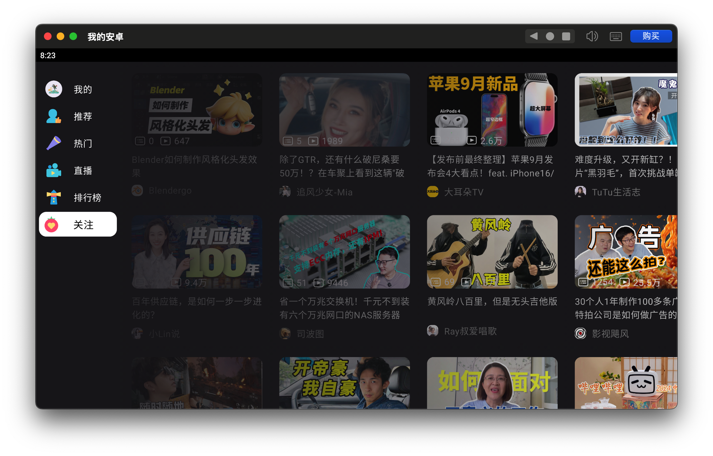
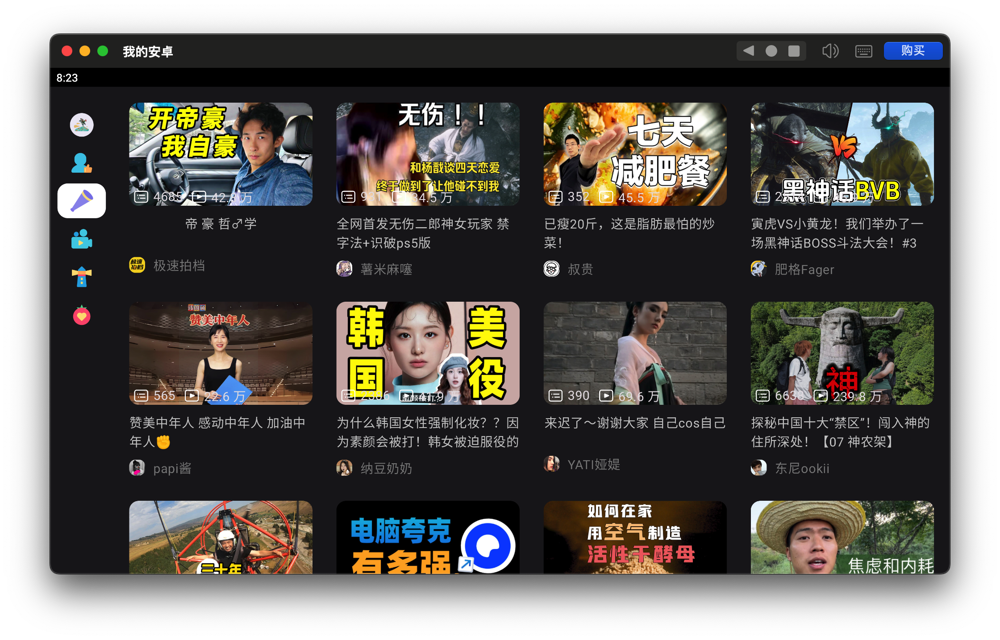
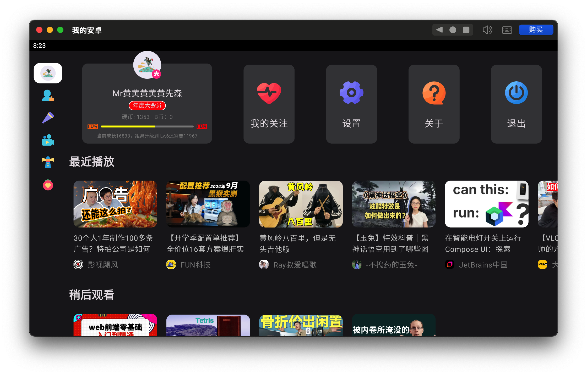

## bilibili for Android TV

 
 
  

本项目基于 Jetpack Compose 使用 Kotlin 开发。对应 Apple TV 客户端将在后续开源。感谢 [哔哩哔哩-API收集整理 ](https://github.com/SocialSisterYi/bilibili-API-collect)项目提供接口信息。

### APP 预览图

 
 
   
   

### TODO

- [ ] 视频详情页
- [ ] 我的关注列表
- [ ] 设置页面
- [ ] 退出登录逻辑
- [ ] 关于页面

### 声明

请勿滥用，本项目仅用于学习和测试！相关内容如有侵权，可联系删除！